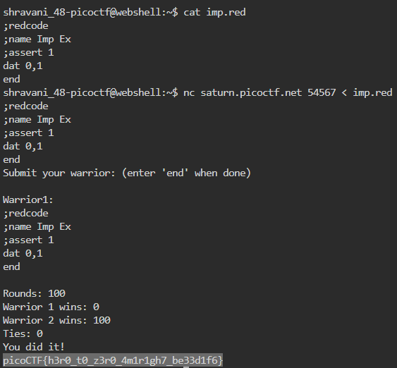

# Ready Gladiator 0

## Can you make a CoreWars warrior that always loses, no ties?

### Additional details will be available after launching your challenge instance.

## Your opponent is the Imp. The source is available here. If you wanted to pit the Imp against himself, you could download the Imp and connect to the CoreWars server like this:nc saturn.picoctf.net 53436 < imp.red

This question is related to a game called CodeWars.

In imp.red we have been given a certain sets of instructions. 

When these instructions are launched in nc, we get a tie hence the requirement is not fullfilled. 

So we need to change these instructions.

Open imp.red using vi: `vi imp.red` and edit `move 0,1` to `dat 0,1` and execute nc again

**Solution: picoCTF{h3r0_t0_z3r0_4m1r1gh7_be33d1f6}**